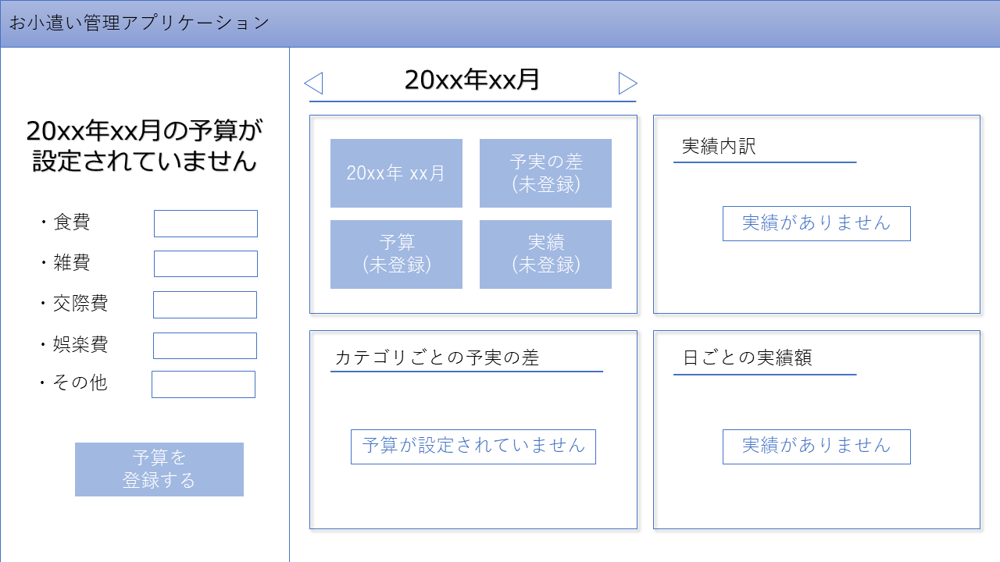
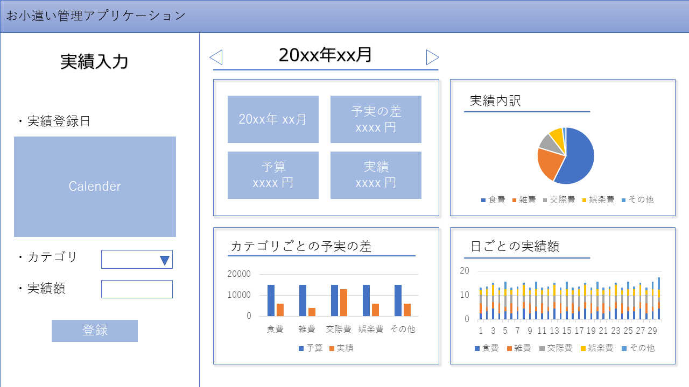
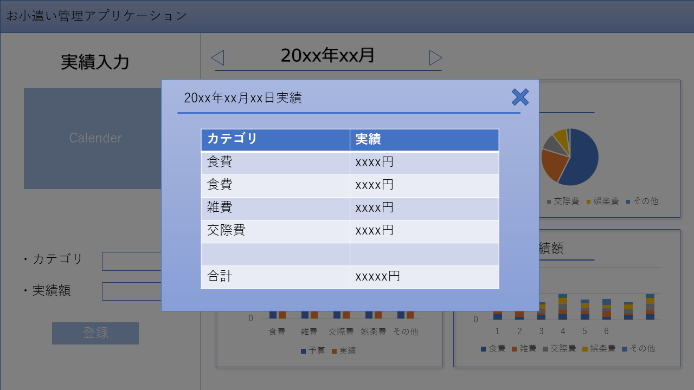

お小遣い管理アプリサンプル
====

## 必須要件

以下の機能を有するアプリケーションの作成を行うとする

- 予算の入力ができる
- 実績を入力することができる
- 予実の差を見ることができる

## データ構造
クライアント上で持つデータの構造  

```json
/* データ構造例 */
{
    "201808": {                     // キーは年(4桁)+月(2桁)
        "budget": {                 // 予算(未登録の場合はundefined)
            "food": 1000,           // 食費
            "sundry": 1000,         // 雑費
            "relationship": 1000,   // 交際費
            "entertainment": 1000,  // その他
            "other": 1000,
        },
        "performance" : [           // 実績(実績未登録の場合、長さ0の配列)
            {
                "date": "2018/08/01",//実績の日付 
                "category": "food", // 実績のカテゴリ
                "perf": 1000,       // 実績の金額
            },
            ...
        ]  
    },
    ...
}
```

----

##　必須要件詳細

### 予算登録

以下のカテゴリごとに予算額を登録できます
    
    - 食費
    - 雑費
    - 交際費
    - 娯楽費
    - その他

### 実績入力

選択済みの日付として実績を入力することができます

    - カテゴリ
    - 実績額


### 予実の差

予実の差を数値及びグラフで見ることができます

- 数値
    全体の総計の差を表示します

- グラフ
    - 全体
        カテゴリごとの予実の差を棒グラフで表現します
    - 実績内訳
        カテゴリごとの実績の割合を見ることができます
    - 日別内訳
        日ごとの実績を積み上げ棒グラフで見ることができます

----

## 画面設計

### 予算未登録時


- 画面左側に予算入力欄が表示される
- グラフ部分は[予算が入力されていません]と表示される。

### 予算登録時


- 予算が表示される
- 実績があればグラフが表示される。
- 実績がない場合は[実績がありませんと表示される]

## 日別実績クリック時


- 日ごとの実績の日付をクリックしたときに表示される
- モーダルの閉じるボタンまたはグレーアウトしているところをクリックするとモーダルが閉じる
